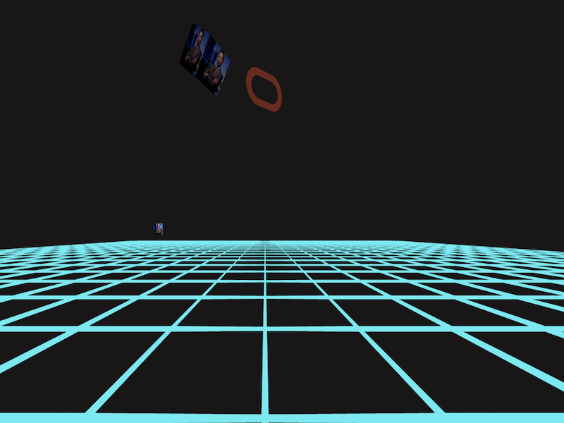

40th Anniversary Tron Day - Metaverse Room on OCI

[](https://img.shields.io/badge/license-UPL-green) [](https://sonarcloud.io/dashboard?id=oracle-devrel_devo-tron-metaverse-room)

## Introduction
40 years ago, Tron, an iconic celebration of storytelling and VR, was released in theaters.
To celebrate, I've created a repository to teach you how you can run your own metaverse rooms and host them on Oracle Cloud Infrastructure.<br>
<br>
[Check it out here](https://3dpr.opcvr.tech/rooms/MetaverseRoom/index.html)<br>

## Getting Started
Before we get started, check out [aframe.io](https://aframe.io/), an open source framework. It's super powerful and its ability to give you access to just about every parameter you can think of means you can pull off some pretty advanced stuff  - especially if you're comfortable using apps like [Blender](https://www.blender.org).<br>
All you need is a web-server! And don't worry - we'll show you how to set one up on OCI. Oh, and did I mention it is free?
Note that you can run multiple rooms on one compute instance!

### Create your free tier instance

To host our metaverse room, we're going to use OCI's [Free Tier](https://signup.cloud.oracle.com/?sourceType=:em:lw:rce:cpo:::RC_WWMK220630P00065:FY23Q1_DevRel_Tron_Day_0709) account. If you need a hand setting that up, my colleague [wrote a tutorial](https://medium.com/oracledevs/create-an-oracle-always-free-cloud-account-bc6aa82c1397) that will get you up and running.
You can use A1 or E2.1 shape - this tutorial will focus on Oracle Linux OS but you can use other distributions (just remember that CLI commands might be different).


### Connect to your instance
Using remote connection of your choice connect to your OCI instance. Here is a link on how to get [started with OCI](https://docs.oracle.com/en-us/iaas/Content/GSG/Reference/overviewworkflow.htm)

Make sure you save or upload your SSH key as we will need to connect to your instance later
To connect to your instance via SSH with key use following command in your terminal of choice - I use VS studio
```
ssh -i </path/to/your/private/key/> <username>@<public IP of your instance>
```

### NGINX Webserver setup
NGINX - is a great open source software that handles web servicing and it consit of many other capabilities. We will be using it as a web server.
Check for packages updates before installing NGINX packages
```
sudo dnf update && sudo dnf upgrade
```


Install nginx using the dnf command  
```
sudo dnf install nginx
```


We want to ensure that Ngix starts after each reboot  
```
sudo systemctl enable nginx
```

To make our webserver accessible from the outside, we’re going to allow access on port 80  
```
sudo firewall-cmd --zone=public --permanent --add-service=http
sudo firewall-cmd --reload
```

All should now be ready to access Nginx from a remote host. Open browser and navigate to `http://YOURHOSTNAME URL`

If you didn’t touch to /etc/nginx/nginx.conf configuration file. It contains a catch-all config. If it’s not the case, add the following to it :
```
server {
    listen       80 default_server;
    listen       [::]:80 default_server;
    server_name  _;
    root         /usr/share/nginx/html;
}
```

Now let’s append a similar server block for the example.com domain to the http block
```
server {
     server_name example.com;
     root /var/www/example.com/;
     access_log /var/log/nginx/example.com/access.log;
     error_log /var/log/nginx/example.com/error.log;
}
```

### Directories Setup

Let’s create the root directory for our domain
```
sudo mkdir -p /var/www/example.com/
```

Set the `httpd_sys_content_t` context on the root directory for SELinux.
```
sudo semanage fcontext -a -t httpd_sys_content_t "/var/www/example.com(/.*)?"
sudo restorecon -Rv /var/www/example.com/
```

These commands set the `httpd_sys_content_t` context on, the `/var/www/example.com/`

Note that you must install `policycoreutils-python-utils` package to run the restorecon commands.


We also need to create the log directory
```
sudo mkdir /var/log/nginx/example.com/
```

It’s time to restart nginx to apply our configurations
```
sudo systemctl restart nginx
```

### Verifying that everything works

In order to ensure that the example.com server bloc works as intended. Let’s add a dummy file to our `/var/www/example.com/folder`. <br>
```
echo "Content for example.com" > /var/www/example.com/index.html
```

Use a browser and connect to `http://example.com`. The web server shows the example content from the `/var/www/example.com/index.html` file.

Use a browser and connect to `IP_address_of_the_server`. The web server shows the example content from the `/usr/share/nginx/html/index.html` file.  

### (optional) Adding TLS to our Nginx server  

If you want to add VR view to your room we will need to add HTTPS capabilities to our server. 
I recommend using Let's Encrypt Certbot to make renewal process much easier.

For starters, we need to enable EPEL Repository (assuming you never did it before).  
```
sudo dnf install -y https://dl.fedoraproject.org/pub/epel/epel-release-latest-8.noarch.rpm
```

After that, enable PowerTools with the following command.
```
sudo dnf config-manager --set-enabled PowerTools
```

As we’re using Nginx as a webserver, we’re going to download the according Cerbot version.
```
sudo dnf install certbot python3-certbot-nginx
```

To check if Certbot is correctly installed, run.
```
certbot --version
```

Request a new certificate from Let’s Encrypt and fill the requested information.
```
sudo certbot --nginx
```

Setup automatic renewal for the certificate(s).
```
sudo echo "0 0,12 * * * root python3 -c 'import random; import time; time.sleep(random.random() * 3600)' && certbot renew -q" | sudo tee -a /etc/crontab > /dev/null
```

### Importing the Room Template to your server

First we need to install git on our instance in order to clone the repository.
```
sudo dnf install git
```

Let’s remove the dummy file in the /var/www/example.com/ folder.
```
cd /var/www/example.com/ && sudo rm index.html
```

Clone the our metaverse room from Github (make sure to keep the "." as we want to have the content of the repo in your Cloud compute folder).
```
sudo git clone https://github.com/oracle-devrel/devo-tron-metaverse-room.git .
```

Use a browser and connect to https://example.com to see your 3DPR loaded!

### Prerequisites
- some knowledge of Cloud and running commands in terminal
- determination
- spare time


…and that is it… your metaverse room is up and running.<br>

## Notes
At Oracle we embrace open source technologies! Our aframe.io code is pretty basic so feel free to improve it! <br>You can find inspiration here [aframe.io examples](https://aframe.io/aframe/examples/)<br>
Another good place to look at is Blender - it's free and very powerful. Perfect if you looking to start your 3D journey. IMHO Blender is absolutely amazing piece of kit and with new 3.2 release, there is a ton of new features make sure to check them out https://www.blender.org/download/releases/3-2/<br>
Another place to check out is this blog done by Mozilla Hubs on how to export glTF files from Blender and import them into webGL experiences. glTF is being considered as an jpeg of 3D and it is royalty free - you can learn more about it here https://www.khronos.org/gltf/

[Join our Slack Community for more info](https://bit.ly/devrel-xrlabs-channel)<br>

## Contributing
This project is open source.  Please submit your contributions by forking this repository and submitting a pull request!  Oracle appreciates any contributions that are made by the open source community.

## Special thanks
@GreatGhostsss for a great soundtrack!

## License
Copyright (c) 2024 Oracle and/or its affiliates.

Licensed under the Universal Permissive License (UPL), Version 1.0.

See [LICENSE](LICENSE) for more details.

ORACLE AND ITS AFFILIATES DO NOT PROVIDE ANY WARRANTY WHATSOEVER, EXPRESS OR IMPLIED, FOR ANY SOFTWARE, MATERIAL OR CONTENT OF ANY KIND CONTAINED OR PRODUCED WITHIN THIS REPOSITORY, AND IN PARTICULAR SPECIFICALLY DISCLAIM ANY AND ALL IMPLIED WARRANTIES OF TITLE, NON-INFRINGEMENT, MERCHANTABILITY, AND FITNESS FOR A PARTICULAR PURPOSE.  FURTHERMORE, ORACLE AND ITS AFFILIATES DO NOT REPRESENT THAT ANY CUSTOMARY SECURITY REVIEW HAS BEEN PERFORMED WITH RESPECT TO ANY SOFTWARE, MATERIAL OR CONTENT CONTAINED OR PRODUCED WITHIN THIS REPOSITORY. IN ADDITION, AND WITHOUT LIMITING THE FOREGOING, THIRD PARTIES MAY HAVE POSTED SOFTWARE, MATERIAL OR CONTENT TO THIS REPOSITORY WITHOUT ANY REVIEW. USE AT YOUR OWN RISK. 